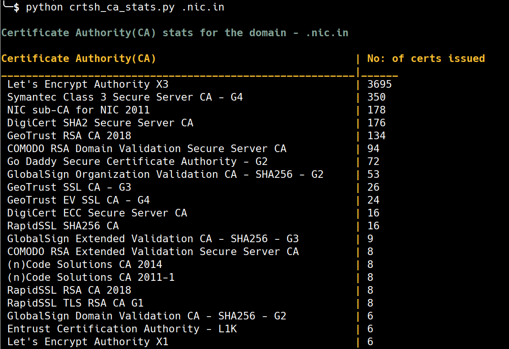

# ctlog-utilities

Quick dirty utilities I scribbled that dig through Certificate Transparency logs using crt.sh

1. **crtsh_ca_stats.py** - For a given domain, the script returns all the Certificate Authority(CA) names and number of SSL/TLS certs the CA issued for that domain
2. **ca_by_certs.py** - Returns all the CAs listed in CT Logs in the order of total number of certs issued ever. You can limit number of CAs printed by passing a number as argument to Python script
3. **emails_from_ctlogs.py** - For a given domain, the script extracts emails from SSL/TLS certs that are part of Certificate Transparency logs

## Installing Python dependencies

Only third-party library needed is [psycopg2](initd.org/psycopg/docs/)

1. You need to install [pipenv](https://docs.pipenv.org/)
2. Run `pipenv install` in the cloned directory to install all the Python package dependencies

## Screenshots

